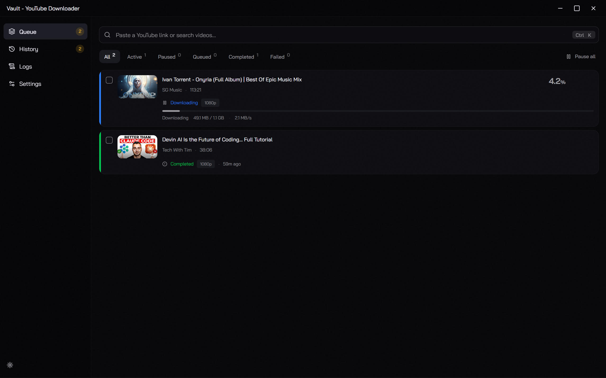
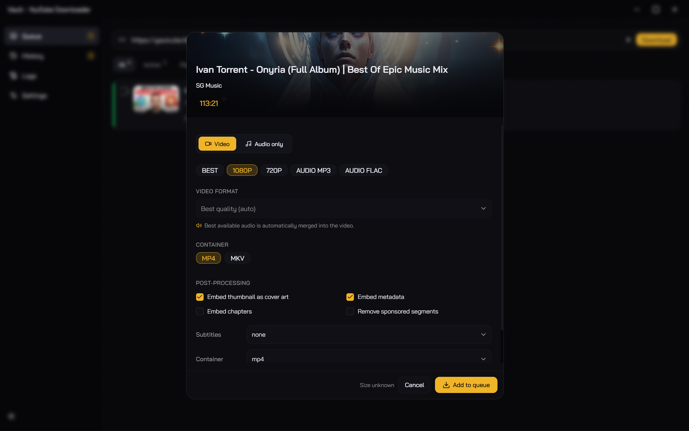
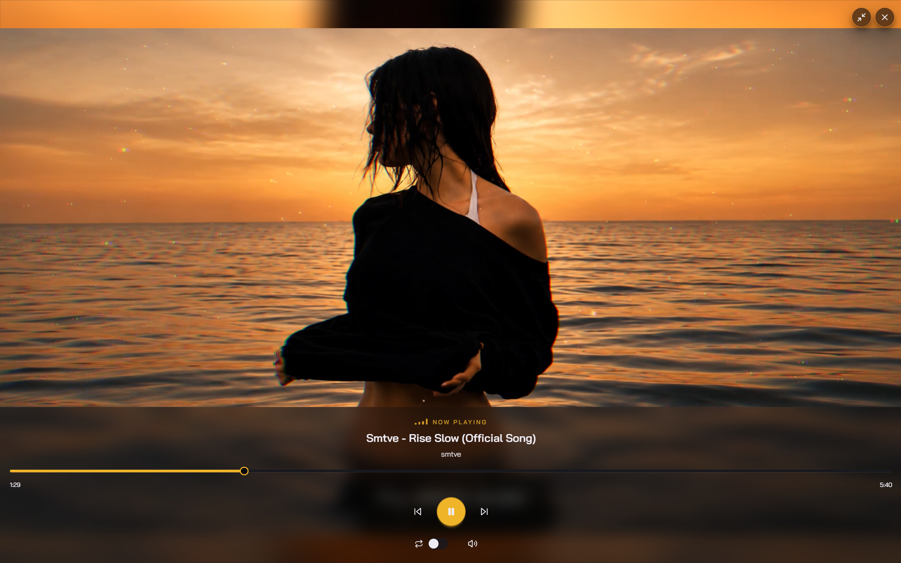
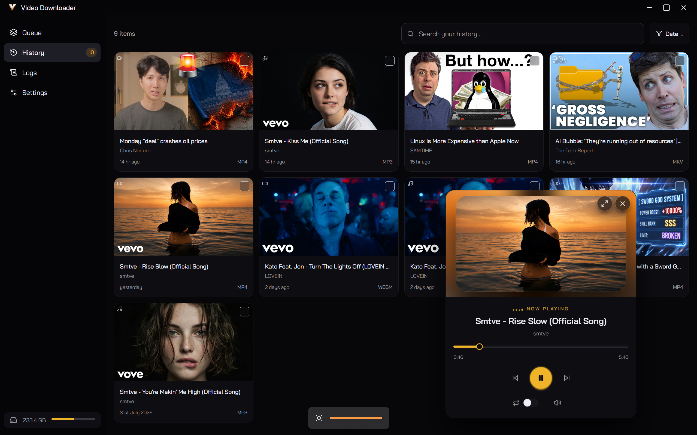
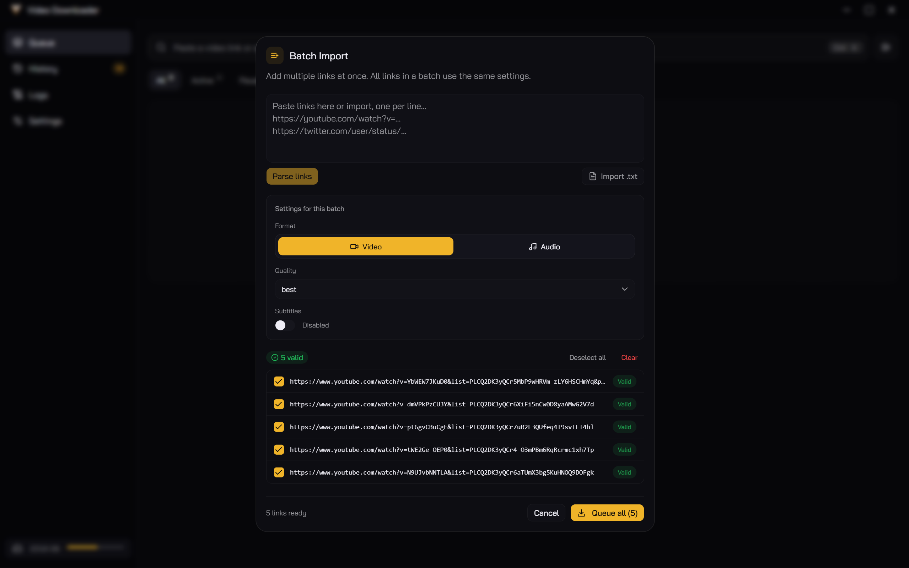

<div align="center">

# Vault

**A fast, modern desktop YouTube downloader — powered by yt-dlp & FFmpeg**

Download videos, playlists, and audio from YouTube and 1000+ sites, entirely on your machine

[Features](#-features) · [Screenshots](#-screenshots) · [Quick Start](#-quick-start) · [Tech Stack](#-tech-stack) · [Project Structure](#-project-structure)


</div>

---

## 📸 Screenshots

<table align="center">
  <tr>
    <td align="center" width="50%">
      <a href="screenshots/queue.png"></a>
      <br/>
      <sub><b>Queue</b> — paste a link or search, then track live progress</sub>
    </td>
    <td align="center" width="50%">
      <a href="screenshots/format-modal.png"></a>
      <br/>
      <sub><b>Format modal</b> — one-click presets, container choice, and post-processing</sub>
    </td>
  </tr>
  <tr>
    <td align="center" width="50%">
      <a href="screenshots/player-fullscreen.png"></a>
      <br/>
      <sub><b>Player</b> — distraction-free media playback for your downloaded content</sub>
    </td>
    <td align="center" width="50%">
      <a href="screenshots/player-miniscreen.png"></a>
      <br/>
      <sub><b>Mini Player</b> — picture-in-picture player overlay for multitasking</sub>
    </td>
  </tr>
  <tr>
    <td align="center" width="50%" colspan="2">
      <a href="screenshots/bulk-import.png"></a>
      <br/>
      <sub><b>Batch Import</b> — queue multiple links at once from text or files</sub>
    </td>
  </tr>
</table>

---

## ✨ Features

### Download & Formats

- **Paste or search** — drop a YouTube link _or_ search by keyword right from the URL bar
- **Clipboard detection** — automatically detects copied media URLs and prompts you to queue them for download
- **Batch import** — paste a list of URLs or import a `.txt` file to queue multiple downloads at once
- **Videos, playlists & audio** — download single videos, whole playlists (with a configurable fetch limit), or extract audio
- **Quick presets** — one click for **Best**, **1080p**, **720p**, **Audio MP3**, or **Audio FLAC**
- **Manual control** — hand-pick a specific format, container (**MP4 / MKV**), audio codec, and bitrate
- **Time-range trimming** — crop any download to a specific start/end time directly from the Format Modal before it hits the queue

### Queue & History

- **Concurrent queue** — configurable parallel downloads with pause, resume, retry, and cancel (single or bulk)
- **Real-time progress** — live speed, ETA, and status for every job
- **History** — SQLite-backed history with search, filters, bulk actions, and missing-file detection
- **Download archive** — skip already-downloaded items on re-runs, with an overwrite prompt when files exist

### Post-Processing & Access

- **Embed** thumbnails, metadata, and chapters into output files
- **Subtitles** and **SponsorBlock** segment removal
- **Browser cookies** — import cookies from your installed browser for age-gated, private, or members-only content

### Media Player

- **Built-in playback** — distraction-free media player for your downloaded audio and video
- **Mini Player** — picture-in-picture overlay mode for multitasking while watching
- **Local streaming** — watch your downloads immediately without opening external media players

### Experience

- **Zero setup** — yt-dlp and FFmpeg are **auto-downloaded** on first run for your platform
- **Polished UI** — frameless custom titlebar, light/dark themes, command palette, and first-run onboarding
- **Self-updating** — built-in in-app auto-update

---

## 🚀 Quick Start

```bash
git clone https://github.com/Kendrick-Oppong/vault.git
cd vault
pnpm install
pnpm dev:desktop
```

> Requires **Node.js** (see [`.nvmrc`](./.nvmrc)) and **pnpm 8+**. yt-dlp and FFmpeg are fetched automatically on first launch.

**Common scripts**

```bash
pnpm dev:desktop      # run the desktop app with hot reload
pnpm build:desktop    # build the desktop app
pnpm lint             # lint all workspaces
pnpm format           # format with Prettier
```

---

## 🧩 Tech Stack

**Electron** · **React 19** · **TypeScript** · **Tailwind CSS v4** + **shadcn/ui** · **TanStack Query** · **Zustand** · **better-sqlite3** · **yt-dlp** + **FFmpeg**

---

## 📁 Project Structure

```
apps/desktop     Electron app (main / preload / renderer)
apps/web         Landing page (Next.js)
packages/ui      Shared UI components
packages/types   Shared TypeScript types
packages/config  Shared constants
```

---

## 📄 License

MIT — see [LICENSE](LICENSE).
